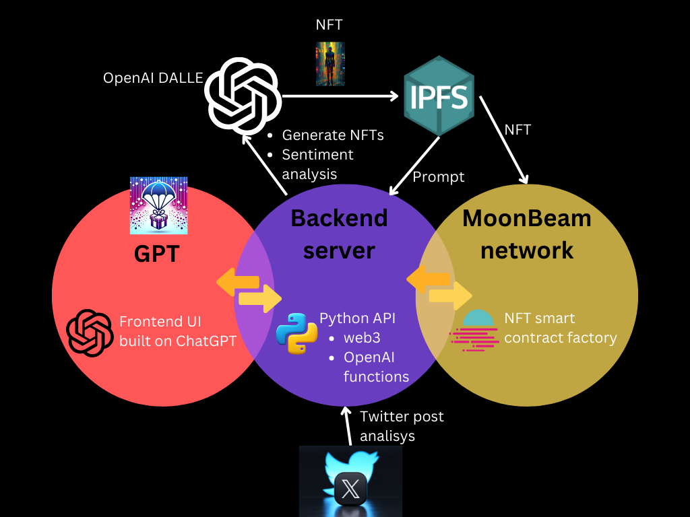

# PolkaAirdrops

- **Team Name:** AI Agents Lab  
- **Payment Address:** 14atBfY6PexLsYLsCUxvEv2Ra5naHWpf6SN2KkFJdMydU47o
- **[Level](https://github.com/w3f/Grants-Program/tree/master#level_slider-levels):** 2


## Project Overview :page_facing_up:

### Overview

PolkaAirdrops is an advanced airdrop automation platform tailored for crypto projects on the Polkadot network.
Its standout feature is the integration of generative AI technology to create unique NFTs and automate their distribution 
using the power of AI to active project ambassadors on social media, particularly Twitter.

Airdrops is an effective technique of marketing and promotion of crypto projects with a wide impact. 
Famous airdrops such as Axie Infinity on 2021, achieved over 2 million participants. 
This year 2023, chainGPT airdrop reached almost 1 million participants.

Our team is passionate about creating the PolkaAirdrops project because we recognize the untapped potential 
within the Polkadot ecosystem and the critical need for enhanced visibility of its projects. 
We are driven by the opportunity to leverage cutting-edge generative AI technology to bridge this gap,
fostering community engagement and attracting potential investors and users to Polkadot's innovative ecosystem.

The immense potential we see in combining the power of airdrops with the expansive reach of social networks like Twitter
provides an exceptional opportunity to amplify the visibility and appeal of Polkadot projects, reaching a diverse and extensive global audience in a way that is both innovative and highly effective.

In our pursuit to realize this vision with PolkaAirdrops, we are leveraging the cutting-edge capabilities of Generative Pre-trained Transformers (GPTs) for advanced natural language processing and sentiment analysis. This technology enables us to intelligently and automatically identify and reward positive social media engagements with precision. Simultaneously, we are utilizing EVM-compatible Moonbeam smart contracts to ensure seamless, secure, and efficient airdrop distributions. This harmonious integration of GPTs' AI prowess with Moonbeam's robust and flexible smart contract functionality embodies our commitment to innovation and efficiency, propelling us towards achieving our goal of elevating Polkadot projects' visibility on a global scale.

### Key Features:

* Generative AI-Driven NFT Creation: PolkaAirdrops allows to design and mint unique NFTs. These NFTs are not only visually distinctive but also embed certain characteristics or metadata that align with the crypto project's theme and ethos. This approach ensures that each NFT is exclusive and resonates with the project's branding.

* Automated Ambassador Recognition and Reward: The platform uses AI to analyze Twitter for posts displaying positive sentiment towards the crypto project. It identifies key influencers and active community members, categorizing them as project ambassadors. These ambassadors are automatically rewarded with the unique NFTs created by the AI, fostering a sense of exclusivity and belonging.

* Seamless Integration with Twitter and Sentiment Analysis: The integration with Twitter allows PolkaAirdrops  to monitor real-time data feeds and apply advanced sentiment analysis. This feature ensures that only genuine and positive engagements are rewarded, enhancing the campaign's effectiveness.

* Smart Contract Automation for NFT Distribution: The distribution of NFTs to ambassadors is governed by smart contracts on the Polkadot network. These contracts are programmed to automatically transfer NFTs to the wallets of identified ambassadors, ensuring a transparent and efficient process.

### Project Details

The integration of generative AI for automatically creating and distributing NFTs adds a novel dimension to crypto project promotions. This approach not only enhances user engagement but also elevates the perceived value and uniqueness of the project, potentially leading to higher visibility and adoption rates.

The main architecture of the project is depicted in the figure below

 

The main components are described here:

* GPT. This is the front-end component that implements the UI. It is leveraging the GPTs solution of OpenAI platform. OpenAI platform allows to design GPTs to automate the iteraction with users. Our users are defined as the projects or event managers that want to create a viral airdrop compaing on twitter, and also ambassadors that are posting tweets with the goal to propelling the project visibility and thus
get the NFT reward. The benefit of using the UI OpenAI platform is threefold:
  * Leverages the 1 billion monthly active users.
  * It is responsible being supported in both mobile and desktop devices. 
  * It is the fastest growing company in internet today. 
  
  The own PolkaAirdops GPT allows to interact with project manager to help launching the airdrop campaing by defining the NFT to the project branding and the tweet analysis.  

* Backend server. This represents the core of the PolkaAirdrop platform. It is implemented enterely with python. Its main functions are described below:
  * It exposes an API so the GPT can interact with the backend service to create the airdrop campaing. In this process the airdrop project specific prompt will be stored encrypted in the public IPFS. 
  * It uses the twitter public API to collect the ambassador tweets. 
  * It uses the propetary OpenAI GPT4 to perform the accurate sentiment analysis of the tweets and check that are related to the aridrop project.   
  * It creates the unique NFT following the prompt instructions already set up by the airdrop project. For this sake, it will use the propetary OpenAI DALLE-3 API. This unique NFT will be stored in the IPFS using the python IPFS API where we updload the NFT and obtain back the IPFS URI to mint later the NFT using the project smart contract.
  This is an example of the call to the DALLE-3 to generate a NFT:
      ```
        from openai import OpenAI
        client = OpenAI()

        response = client.images.generate(
          model="dall-e-3",
          prompt="project airdrop prompt",
          size="1024x1024",
          quality="standard",
          n=1,
        )
        image_url = response.data[0].url
      ```
  * It mints the particular NFT that will be rewarded to the ambassadors using the web3 python api. This api allows to mint the NFT in the Polkadot MoonBeam network. The NFT will be available for project ambassadors in their Polkadot Talisman wallet. Moreover the NFTs can also be traded in the Mintverse platform which is the world’s leading NFT aggregation marketplace, where users can easily collect and trade various types of NFT assets. Minting is performed using the new feature of dynamic NFT minting available in project's airdrop smart contract defined below. 


* Moonbeam smart contract. This contract is a factory smart contract that creates a specific smart contract for the project airdrop allowing to mint and distribute the NFTs to the rewarded ambassadors. The project manager of the airdrop must send GLMR coins to the factory smart contract to create the propietary project NFT smart contract. 
Moonbeam is a perfect fit for our project because it allows for building cross-chain connected applications in the Polkadot ecosystem. Moonbeam powers dApps that can access users, assets, and services on any chain. Moreover Moonbeam leverage EVM complatible smart contracts programming where our team has extensive expertise. 
Here is an excerpt of the connection of the backend server to the Moonbeam smart contract.

    ```
    from web3 import Web3

    provider_rpc = {
        "development": "http://localhost:9944",
        "moonbase": "https://rpc.api.moonbase.moonbeam.network",
    }
    web3 = Web3(Web3.HTTPProvider(provider_rpc["moonbase"]))  

    ```


### PolkaAirdrop UI Mockups 

Our team already developed an UI mockup in the OpenAI platform for the GPT. 
This is shown in the figure below.

 


As you can see in the figure, the users will see our PolkaAirdrops applpication where they can manage the Airdrop campaing and also claim the NFT airdrops. 
The PolkaAirdrop is a specific GPT that is viewed and directly accessible by billions of users worldwide that it is using the OpenAI platform. Users can install it for free in their own OpenAI platform. 


Once users have been installed the PolkaAirdrop, they will see the PolkaAirdrop UI as seen in the figure below. 


In the figure are depicted the user main actions that will trigger the iteraction with the PolkaAirdrop GPT AI:  
* _How do I create an airdop for my project?_. In this action the GPT AI will guide through the different steps to set up the airdrop such as defining the project manager address, the project prompt NFT, the requisites for ambassadors to get rewarded the NFT, the duration of the airdrop, and so on. 

* _Can you guide me on participation on the airdrop?_. This action is foscused to the ambassadors that the GPT AI will inform the ambassadors the actions that they have to perform to gain the NFT reward. 

* _How do I redeem the airdrop?_. This is after the ending the ending of the airdrop campaing, ambassadors can can back here to redeempt the NFT based on their actions or post performed in the Twitter social network. 

* _What are the current airdrops on the Polkadot network?_. This is informative of the current ongoing airdrop that ambassadors can participate to promote the Polkadot project. 

###  PolkaAirdrop's Limitations 

* We are not intenting to trade NFTs. This is not a marketplace of NFT where anyone can sell and buy NFTs. For this purpose there are already platforms that are offering these services such as  Mintverse. 

* We are focused on NFT airdrops only. The project can be extended to support later on token-based airdrops as well using a similar architecture. However, NFT airdrops provide value benefits to respect to token-based airdrops: 
  * Early access and exclusive benefits: NFT airdrops may provide users with early access to new features, exclusive content, or other perks. This can give them a sense of privilege and make them feel more invested in the project.
  * Potential value: Users can receive valuable NFTs for free, which could potentially increase in value over time. This can be an attractive incentive for users to participate in airdrops.
  * Increased visibility and shareability. NFT airdrops are highly shareable in social network due to the visual nature of the NFT. 


* Project promotion is limited to the Twitter social network. Althoug there are multiple social newtwors available such as Youtube, and Instagram. Twitter represents a social network as large as these platform with a Monetizable Daily Active Users (mDAU) of 330 millions.
Youtube and Instagram have 129 mDAU and 330 mDAU, respectively. 
Moreover, Twitter has been used as an excellent platform for building communities around crypto projects and also 
Twitter is home to a large number of crypto influencers, who are individuals with a large following and a high level of credibility among the crypto community. 

* It is not a NFT wallet. PolkaAirdrop is not a wallet to view your NFTs. For this purpose you can use the Talisman wallet. PolkaAirdrop is only designed to automate the distribution of airdrops.


### Ecosystem Fit

*  Where and how does your project fit into the ecosystem?

  In our understanding, it will be better fit in the User Interface open-source Polkadot Tech Stack. 
  Our project will offer listing and managing of current Airdrops on the Polkadot ecosystem.
  Up to now, there is no such as solution already implemented in the Polkadot Tech Stack. 
  Our solution, designed to be completely open source, directly benefits Polkadot projects
  by offering them access to our AI-driven automation software stack. 
  This innovative tool is specifically crafted to significantly boost their 
  visibility on social networks, enhancing their outreach and engagement within the digital community.


*  Who is your target audience (parachain/dapp/wallet/UI developers, designers, your own user base, some dapp's userbase, yourself)?

  Our target audience primarily consists of Polkadot project marketing teams aiming to extend their reach to a broader audience. Additionally, our project introduces an unparalleled solution in bridging the gap between social network influencers and ambassadors and the Polkadot project marketing teams. This innovative merging is designed to create a mutually beneficial ecosystem where influencers and ambassadors can significantly amplify the visibility and appeal of Polkadot projects, driving engagement and adoption in the wider crypto community. Through this strategic alignment, PolkaAirdrops sets a new standard in digital marketing within the blockchain space, offering a unique and powerful tool for Polkadot projects to stand out in an increasingly competitive market.


*  What need(s) does your project meet?
  
  Our project, PolkaAirdrops, meets several critical needs in the Polkadot Tech Stack:

  * Enhanced Project Visibility: It addresses the fundamental need for increased visibility and recognition of Polkadot projects within the crowded and competitive cryptocurrency market. Currently, there is a lack of ambasadors and influencers embracing
  Polkadot projects. Our project solves this critical need by automating the crowdsourcing of project ambassadors on social media using 
  NFT airdrops.

  * Effective Community Engagement: The project provides an effective way for Polkadot projects to engage with and expand their community, particularly by connecting with influencers and ambassadors on social media platforms like Twitter. 

  * Automated and Targeted Marketing: Utilizing AI and smart contracts, PolkaPromo AI meets the need for automated, efficient, and targeted marketing campaigns, reducing the manual effort and increasing the precision of promotional activities.

  * Rewarding User Participation: By integrating airdrops with social media engagement, our project fulfills the need to incentivize and reward active community participation, which is crucial for building a loyal and enthusiastic user base.


* Are there any other projects similar to yours in the Substrate / Polkadot / Kusama ecosystem?

  Our project is unique in the Polkadot ecosystem. However, recently it has been launch this year (2023) a similar project 
  that uses AI to generate NFT. This project is called ChainGPT, https://www.chaingpt.org.
  This project has been successfully launched in the Ethereum network with a current marketcap of $38 million.
  The main difference is that we are automating the promotion and distribution of NFTs on social networks. 
  In addition,  we are leveraging the global impact of OpenAI by integrating our project to the  current OpenAI ecosystem. 


## Team :busts_in_silhouette:

### Team members

- Jose Carlos Sancho, (founder, PhD. in Computer Science, AI and smart contract developer) 
- Alexander Salas (Full-stack developer and AI developer)
- Mariana Matheus (social media marketing expert) 


### Contact

- **Contact Name:**  Jose Carlos Sancho
- **Contact Email:** aiagentslab@gmail.com
- **Website:**       aiagentslab.com

### Legal Structure

- **Registered Address:** 500 4th St NW, Suite 102, Albuquerque, NM 87102, USA.
- **Registered Legal Entity:** AI Agents Lab LLC

### Team's experience

Jose Carlos Sancho, founder of AI Agents Lab, currently holds a PhD in Computer Science. 
10 years experience on blockchain technology, NFTs, and currently in AI Generative Pre-trained Transformers (GPTs).
Alexander Salas, senior software developer currently contributing to many AI projects. 
Mariana Matheus, graduated in Business administration with an special interest on marketing on social media. 

Overall, our team has extensive experience on developing different software stacks.
Our team developed an NFT project in the past. We have a solid programming expertise in NFT smart contracts on the EVM Ethernet network.
In addition, we have expertise on developing on the OpenAI software stack using the OpenAI API.
Recently, we have developed several trained GPTs that are public available:
* Photorealistic: https://chat.openai.com/g/g-lp1vmS7nC-photorealistic
* BrainWave: https://chat.openai.com/g/g-o74FlvLep-brainwave
* CryptoMastery: https://chat.openai.com/g/g-xVvJBeYik-crypto-mastery 


This is our first time applying to the Web3 Foundation Grants. 


### Team Code Repos

- https://github.com/AI-Agents-Lab/PolkaAirdrops


Please also provide the GitHub accounts of all team members. If they contain no activity, references to projects hosted elsewhere or live are also fine.

- https://github.com/jcsancho
- https://github.com/ajsb85

### Team LinkedIn Profiles (if available)

- https://www.linkedin.com/josecsancho/
- https://www.linkedin.com/ajsb85/
- https://www.linkedin.com/mariana-matheus-872a71262/


## Development Status :open_book:

If you've already started implementing your project or it is part of a larger repository, please provide a link and a description of the code here. In any case, please provide some documentation on the research and other work you have conducted before applying. This could be:

- links to improvement proposals or [RFPs](https://github.com/w3f/Grants-Program/tree/master/docs/RFPs) (requests for proposal),
- academic publications relevant to the problem,
- links to your research diary, blog posts, articles, forum discussions or open GitHub issues,
- references to conversations you might have had related to this project with anyone from the Web3 Foundation,
- previous interface iterations, such as mock-ups and wireframes.

## Development Roadmap :nut_and_bolt:

### Overview

- **Total Estimated Duration:** 4 months
- **Full-Time Equivalent (FTE):**  5 FTE
- **Total Costs:** 30,000 USD.

### Milestone 1 — GPT training 

- **Estimated duration:** 8 weeks
- **FTE:**  2.5
- **Costs:** 15,000 USD

| Number | Deliverable | Specification |
| -----: | ----------- | ------------- |
| **0a.** | License | Apache 2.0 |
| **0b.** | Documentation | We will provide technical documents and user guides |
| **0c.** | Testing and Testing Guide | Core functions will be fully covered by comprehensive unit tests to ensure functionality and robustness. In the guide, we will describe how to run these tests. |
| **0d.** | Docker | We will provide a Dockerfile that can be used to test all the functionality delivered with the GPT trained. |
| 1.      |  UI Design        | We will design the main actions for creation, managing, and participating Airdrops in the GPT UI. |
| 2.      |  GPT training     | We will train the GPT to perform the different actions designed previously. |
| 3.      |  GPT API          | We will implement the GPT api calls that will interface with the backend server.  |
| 4.      |  NFT creation     | We will implement the NFT creation functions in the backend server using the  openAI API to create NFTs.|
| 5.      |  IPFS storage     | We will implement the IPFS functions to store  the NFTs and promtps in the backend server.  |
| 6.      |  Twitter          | We will implement the sentiment analysis funtionality in the backend server using the Twitter API.  |
| 7.      |  Testing GPT      | Testing the implemented components above. Achieve a testing coverage of the functionalities above 90%  |


### Milestone 2  — NFT smart contract factory

- **Estimated duration:** 8 weeks
- **FTE:**  2.5
- **Costs:** 15,000 USD

| Number | Deliverable | Specification |
| -----: | ----------- | ------------- |
| **0a.** | License | Apache 2.0 |
| **0b.** | Documentation | We will provide technical documents and user guides |
| **0c.** | Testing and Testing Guide | Core functions will be fully covered by comprehensive unit tests to ensure functionality and robustness. In the guide, we will describe how to run these tests.|
| **0d.** | Docker | We will provide a Dockerfile that can be used to test all the functionality delivered with the NFT smart contract factory. |
| **0e.** | Article | We will publish an article video that explains the functionality of the project. First, from the project manager we will show how to create an airdrop campaing. And lastly, from the ambassador side, we will show how to participate and redeem NFTs. |

| 1. | Factory Smart contract  | We will deliver  the Moonbeam smart contract factory that will create the different project smart contracts. |
| 2. | NFT Dynamic Smart contract | We will deliver the Moonbeam dynamic smart contract for projects that will mint the NFTs and distribute the NFTs. |
| 3. | Backend API  | We will develop the API in the backend server to interact with the smart contract factory.  |
| 4. | Monetization | We will develop the platform monetization mechanism to support future further developments.  |
| 5. | Testing smart contracts  | Testing the smart contract robustness and functionality as well as the monetization mechanism.  |


## Future Plans

* We will extend the PolkaAirdrop project to support token-based airdrops.
* We will extend the promotion of airdrops on other popular social media networks such as Instagram or WeChat.

The project will be maintained after the grant as using with own funds, and also the project 
is proposing a unique business model already being used in other similar platforms such as chainGPT as commented before. 
This business model is based on collecting a fee  for each NFT project launch the platfrom.


## Additional Information :heavy_plus_sign:


**How did you hear about the Grants Program?** Announcement by the Polkadot CoinReference Team
